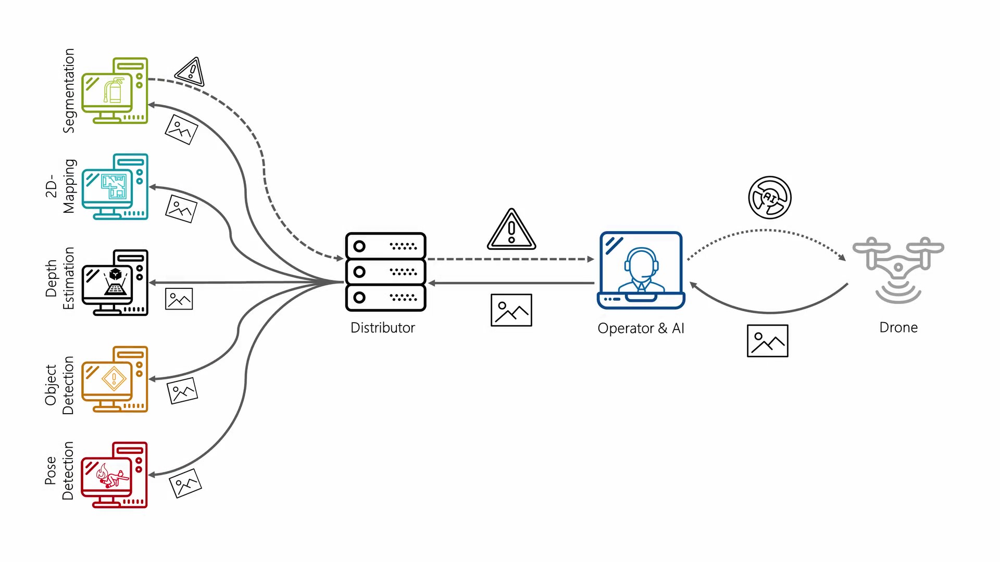

# Systemdesign
Das Systemdesign besteht aus zwei Netzwerken, die Informationen miteinader austauschen. In dem UAV-Network befinden sich kritische sowie echtzeitfähige Systemkomponenten, die maßgeblich dazu beitragen, den Operator zu unterstützen. Der Videostream wird dabei in das Distributor-Network an den Distributor gesendet. Dabei verteilt dieser den Videostream an weitere Verfahren, die nicht in der Lage sein müssen, echtzeitfähigkeit zu garantieren. Somit können unterschiedliche Verfahren im Hintergrund laufen, ohne den Systemablauf zu beeinflussen und den kritischen Verfahren wie z. B. dem autonomen Korrdiorflug Resourcen zu entreißen. Die Ergebnisse der Verfahren können aus dem Distributor-Network an den Operator in das UAV-Network weitergeleitet werden. Durch diesen Informationsfluss kann der Operator auf verschiedene Situationen reagieren, die durch die Künstliche Intelligenz im UAV-Network eventuell nicht abgedeckt sind. Somit ist der Operator zu jeder Zeit in der Lage, dass UAV mittels einem Controller über eine Grafische Benutzeroberfläche zu steuern und die KI ein- und auszuschalten. 

