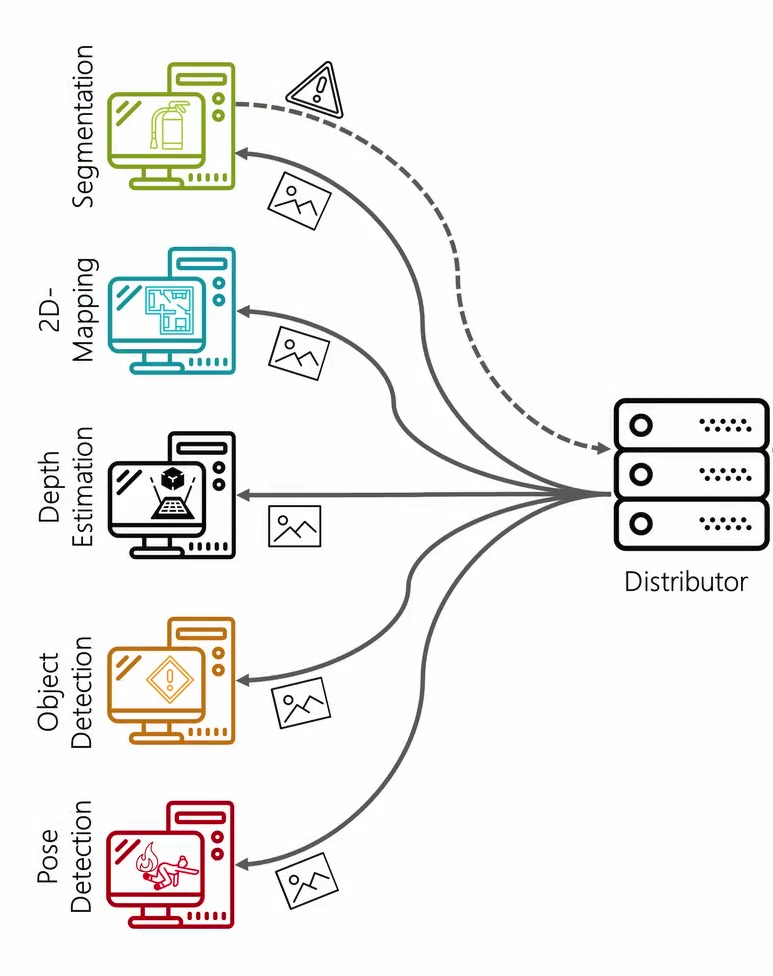

# Struktur
In diesem Verzeichnis sind die einzelnen Endgeräte aufgelistet, die die Kameradaten der Drohne nutzen, um Informationen aus den einzelnen Bildern zu gewinnen, damit diese den Operator und ggf. die Einsatzleitung entlasten und unterstützen. Die einzelnen Engeräte verschiedene KI-Verfahren.
Folgende KI-Verfahren werden verwendet:
* Semantische Segmentierung
* Object Detection
* Depth-Estimation
* 2D-mapping

