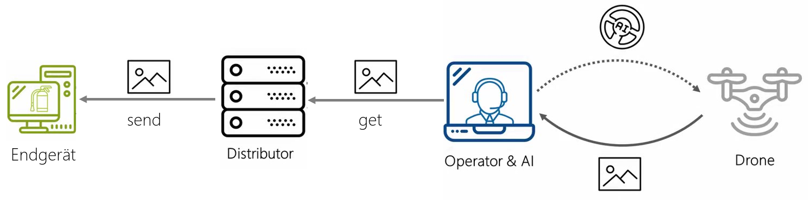
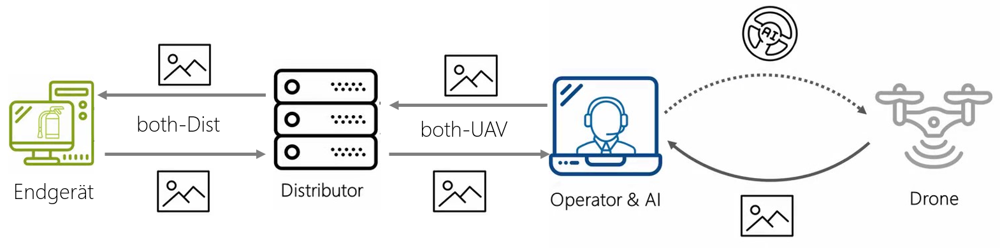

# Inhaltsvrzeichnis
<!--ts-->
   * [Einleitung](#einleitung)
   * [Installation](#installation)
   * [Realisierung](#verwendung)
      * [Oberfläche](#oberfläche)
      * [Kommunikationsart](#kommunikationsart)
   * [Verwendung](#verwendung)
   * [Old](#old)
<!--te-->

# Einleitung
Der Distributor-Configurator ist ein Werkzeug, um die Verbindung zwischen dem UAV-Network und dem Distributor-Network aufzubauen. In diesem Verzeichnis ist das Programm zur Installation und Ausführung beschrieben.

# Installation
Dieses Programm ist mit python3 in Tkinter auf dem System Ubuntu 18.04 LTS entwickelt worden. Daher muss Python3 installiert worden sein. Ist das nicht der Fall, sollte dies mit folgenden Befehl nachgeholt werden.
```
sudo apt-get install python3
```
Im Anschluss sollte Tkinter installiert werden. Dafür wird folgender Befehl verwendet.
```
sudo apt-get install python3-tk
```
# Realisierung
Wie beschrieben wurde das Programm in Tkinter entwickelt. Dabei wurden drei Python-Module verwendet.
```
* ui.py
* main.py
* network.py
```
- Das Main-Modul startet das Distributor Programm.
- Das ui-Modul stellt eine Klasse bereit die die Grafische Oberfläche erstellt. Außerdem erstellt dieses Modul für jede Verbindung die Aufgebaut werden soll ein Thread. Es wurden hier ausschließlich Threads gewählt, da Threads leichtgewichtiger sind und schneller erzeugt werden können als Prozesse.
Das network-Modul enthält eine Schnittstelle zum Kommunikationsaufbau in die jeweiligen Netze

Für die Datei *distributer.py* siehe Abschnitt [Old](#old)
## Oberfläche
In diesem Abschnitt wird die Grafische Benutzeroberfläche anhand eines Bildes beschrieben.

## Kommunikationsart
Wie im Abschnitt zu sehen ist, gibt es mehrere Kommunikationsarten. Diese sind
* Send
* Get
* Both-UAV
* Both-Dist

- Mit *get* holt sich der Distributor die Rohdaten von der Drohne und speichert diese zwischen.
- Mit *send* werden die Rohdaten an die Endgeräte gesendet.

- Mit *Both-Dist* werden die Rohdaten an die Endgeräte gesendet und das Verarbeitete Bild auf dem Endgerät wird zurückgesendet. Dieses Bearbeitete Bild, wird mit dem Rohbild Fusioniert, um Informationen anzuzeigen.
- Mit *Both-UAV* holt sich der Distributor die Rohdaten von der Drohne und sendet die Fusionierten Bilder in das UAV-Netzwerk bzw. an den Operator, um diesen zu unterstützen.

# Verwendung
Sind die benötigten Abhängigkeiten installiert, kann das Programm mit dem Befehl
````
python3 main.py
````
gestartet werden. Soll das Programm geschlossen werden, muss das Kreuzchen in der Gui betätigt oder der Task beendet werden.

# Old
In diesem Verzeichnis ist eine weitere Datei zu finden namens *distributer.py* diese Datei ist der Vorgänger des Distributor-Konfigurator. Dieses Programm kann ausschließlich die Daten aus dem UAV-Netz empfangen und in das Distributor-Netz senden. Darüber hinaus, muss die Kommunikation von den Endgeräten heraus aufgebaut werden.
