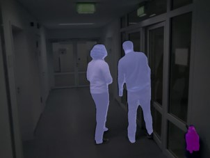

# Segmentierung

# Inhaltsverzeichnis
<!--ts-->
   * [Einleitung](#einleitung)
   * [Installation](#installation)
   * [Realisierung](#realisierung)
   * [Anwendung](#anwendung)
      * [Person-Part](#person-part)
      * [PascalVOC](#pascalVOC)
<!--te-->


# Einleitung
In diesem Verzeichnis wird beschrieben, wie die Semantische Segmentierung verwendet werden kann.
Die Semantische Segementierung wurde mit pytorch realisiert und auf dem Betriebssystem Linux 18.04 LTS mit Python3 getestet.

# Installation
Da dieses Programm mit Python3 funktioniert muss folgender Befehl eingegeben werden um Python3 zu installieren.
````
sudo apt-get install python3
````

Da weitere Abhängigkeiten für die Semantische Segmentierung benötigt werden, können diese mit folgenden Befehl installiert werden.
````
sudo -H pip3 install -r requirements.txt
````

# Realisierung

Dieses Verzeichnis bietet zwei Module:
1. personpart.py
2. voc.py


Das Modul *personpart.py* ist darauf trainiert die Bodyparts einzelner Personen zu erkennen.


Das Modul *voc.py* wurde auf 21 Unterschiedliche Klassen Trainiert.



# Anwendung
In diesem Abschnitt wird beschrieben, wie die einzelnen Module verwendet werden können.

## Person-Part
Das Modul personpart.py kann mit dem Befehl
````
python3 personpart.py
````
gestartet werden. Dabei wird Zugriff auf die Webcam genommen und das Bild mittels Semantischer Segmentierung bearbeitet und in einem Fenster ausgegeben. Es können jedoch auch andere Optionen gewählt werden, indem Parameter dem Programm übergeben werden.

Folgend sind die Parameter für die Datei **personpart.py** aufgelistet und ihre Einstellmöglichkeiten:
````
 --model person50
   person50 (default)
   person101
   person152
 --scale_factor 1
   1 (default)
   0.99
   ...
   0
 --host_ip None
   Ip-Adresse
 --port None
   Port
 --cmap 'cmap.npy'
   Pfad zur cmap.npy
 --mode webcam
   webcam (default)
   listen
   saveVideo
 --InputFile None
   Pfad zum Video was bearbeitet werden soll
 --OutputFile None
   Name zu schreibenden Datei. Diese wird in OutputVideos geschrieben
````

Mit dem Parameter *--model* wird entschieden welches Model ausgeführt werden soll.
Mit dem Parameter *--scale_factor* lässt sich das Bild welches in die KI gegeben wird herunterskalieren, falls die Grafikkarte nicht gut genug ist.
Mit dem Parameter *--host_ip* kann im Modus Listen auf einen bestimmten IP gehorcht werden
Mit dem Parameter *--port* kann im Modus Listen auf einen bestimmten Port gehorcht werden
Mit dem Parameter *--cmap* kann bestimmt werden welche cmap verwendet wird
Mit dem Parameter *--mode* kann der Modus bestimmt werden, was gemacht werden soll. Dabei wird zwischen Webcam, listen und saveVideo unterschieden.
Mit dem Parameter *--InputFile* kann das Video bestimmt werden, welches bearbeitet werden soll.
Mit dem Parameter *--OutputFile* kann der Name der AusgabeDatei bestimmt werden. Das bearbeitete Video ist dann im Ordner videoOutput zu finden

Es ist Außerdem zu erwähnen das in dem Programm ein Filter Programmiert wurde, sodass es Möglich ist manche Label zu deaktivieren. Dies ist Möglich, wenn das Modul *personpart.py* geöffnet wird und oben in dem Datensatz die passenden Variablen auf False gesetzt werden.

## PascalVOC
Das Modul personpart.py kann mit dem Befehl
````
python3 voc.py
````
gestartet werden. Dabei wird Zugriff auf die Webcam genommen und das Bild mittels Semantischer Segmentierung bearbeitet und in einem Fenster ausgegeben. Es können jedoch auch andere Optionen gewählt werden, indem Parameter dem Programm übergeben werden.

Folgend sind die Parameter für die Datei **voc.py** aufgelistet und ihre Einstellmöglichkeiten:
````
 --model voc50
   voc50 (default)
   voc101
   voc152
   vocmb
 --scale_factor 1
   1 (default)
   0.99
   ...
   0
 --host_ip None
   Ip-Adresse
 --port None
   Port
 --cmap 'cmap.npy'
   Pfad zur cmap.npy
 --mode webcam
   webcam (default)
   listen
   saveVideo
 --InputFile None
   Pfad zum Video was bearbeitet werden soll
 --OutputFile None
   Name zu schreibenden Datei. Diese wird in OutputVideos geschrieben
````

Mit dem Parameter *--model* wird entschieden welches Model ausgeführt werden soll.
Mit dem Parameter *--scale_factor* lässt sich das Bild welches in die KI gegeben wird herunterskalieren, falls die Grafikkarte nicht gut genug ist.
Mit dem Parameter *--host_ip* kann im Modus Listen auf einen bestimmten IP gehorcht werden
Mit dem Parameter *--port* kann im Modus Listen auf einen bestimmten Port gehorcht werden
Mit dem Parameter *--cmap* kann bestimmt werden welche cmap verwendet wird
Mit dem Parameter *--mode* kann der Modus bestimmt werden, was gemacht werden soll. Dabei wird zwischen Webcam, listen und saveVideo unterschieden.
Mit dem Parameter *--InputFile* kann das Video bestimmt werden, welches bearbeitet werden soll.
Mit dem Parameter *--OutputFile* kann der Name der AusgabeDatei bestimmt werden. Das bearbeitete Video ist dann im Ordner videoOutput zu finden

Es ist Außerdem zu erwähnen das in dem Programm ein Filter Programmiert wurde, sodass es Möglich ist manche Label zu deaktivieren. Dies ist Möglich, wenn das Modul *voc.py* geöffnet wird und oben in dem Datensatz die passenden Variablen auf False gesetzt werden.
