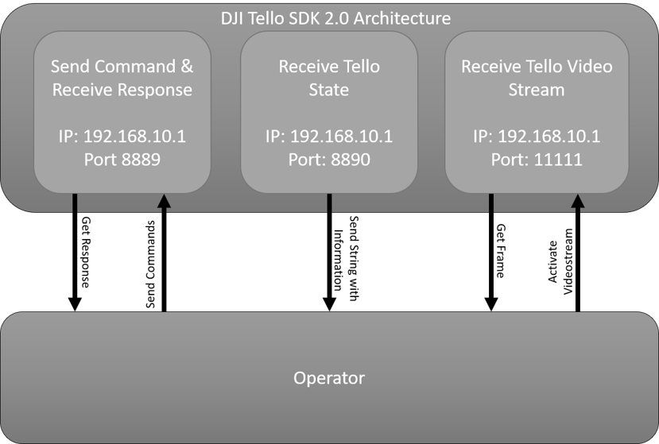

# Operator

# Inhaltsvrzeichnis
<!--ts-->
   * [Einleitung](#einleitung)
   * [Installation](#installation)
   * [Realisierung](#verwendung)
      * [Joystick](#joystick)
      * [Tello](#tello)
      * [User_interface](#user_interface)
   * [Verwendung](#verwendung)
<!--te-->

# Einleitung
Dieses Verzeichnis stellt das Programm "Operator" dar. Hier werden die Unterverzeichnisse *Tello*, *Joystick* und *user_interface* beschrieben. Für mehr infos für die *Navigation* im Verzeichnis *Navigation* nachsehen.

# Installation
Um die Ergebnisse dieses Programms nachzustellen wird das Betriebssystem Ubuntu 18.04 benötigt. Das Programm wurde in Python 2 getestet.

Um den Operator verwenden zu können, wird Python2 und pip benötigt. Dafür bitte folgenden Code ausführen.
```
sudo apt-get install python2 && sudo apt-get install python-pip
```
Für die Module *Tello*, *Joystick* und *user_interface* werden bestimmte packete benötigt. Diese können mit dem Befehl
`./install.sh`
installiert werden.

# Realisierung
In diesem Abschnitt werden die  Funktionalitäten der Moudle *Tello*, *Joystick* und *user_interface* näher beschrieben.

## Joystick
In dem Verzeichnis existiert ein Modul:
* Joystick.py
Dieses Modul wurde mit Pygame entwickelt und stellt eine Klasse bereit, welches beim erstellen eines Objektes nach verfügbaren bzw. unterstützten Controllern sucht. Unterstützte Controller sind:
* PS3
* PS4
* PS4 Alt
* XBox One
* F310
* Taranis

Wird ein unterstützer Controller gefunden, können mit der `run` Funktion des Objektes, die Befehle des Joysticks Interpretiert und zurückgegeben werden.

## Tello
In diesem Verzeichnis sind Zwei Module die für diese Projekt relevant sind. Diese sind
* drone.py
* libh264decoder.so
Die *libh264decoder.so* Datei wird benötigt um die Verschlüsselten bzw. Komprimierten Kameradaten der DJI Tello zu Entschlüsseln.
Das Drohnen Modul ist die Schnittstelle um eine Verbindung mit der Drohne aufzubauen. Diese Verbindung wird mit dem DJI-SDK 2.0 realisiert. Die SDK Architektur basiert auf drei Säulen
* Send & Receive Commands
* Tello State
* Videostream

- Bei *Send & Receive Commands* wird eine Verbindung zu der Drohne aufgebaut und es können der Drohne Befehle mitgeteilt werden.
- Bei der *Tello State* werden periodisch Informationen von der Drohne Empfangen, wie z.B. der Batteriestatus, die Beschleunigung der einzelnen Achsen, etc.
- Beim *Videostream* kann das aktuelle Kamerabild der Drohne empfangen werden.

## User_interface
Das User_interface enthält das Modul *ui.py* welches ein Objekt erstellt, um die Grafische Benutzeroberfläche darzustellen. Zudem baut die *ui* eine Verbindung mit der Drohne über das Modul *drone.py* auf und speichert das erhaltene Kamerabild als Hintergund Bild in der GUI ab. Die GUI wurde mit Tkinter erstellt.
Gleichzeitig startet das Modul eine Netzwerkverbindung und horcht auf den Port 5555


# Verwendung
Der Operator kann mit dem Befehl
````
python main.py
````
gestartet werden.
