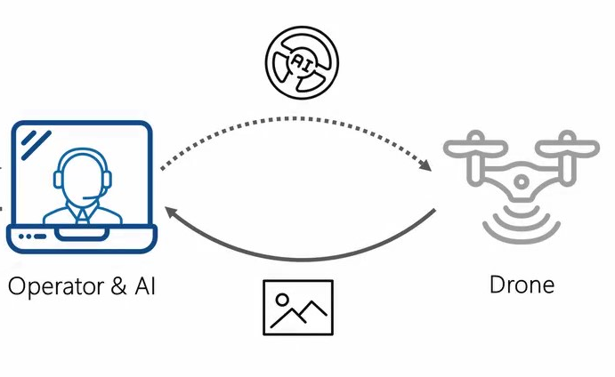

# Operator
## Getting Started
Um die Ergebnisse dieses Programms nachzustellen wird das Betriebssystem Ubuntu 18.04 benötigt. Das Programm wurde in Python 2 getestet.
## Dependencies

```
pip
python2
```
Zum installieren der benötigten Packete den Befehl `./install.sh`

## Running Programm

Soll der Operator/AI gestartet werden, muss das Main Programm gestartet werden

```
python voc_new.py
```

