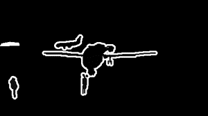

# Segmentierung Training

# Inhaltsverzeichnis
<!--ts-->
   * [Einleitung](#einleitung)
   * [Installation](#installation)
   * [Dataaugmenation](#dataaugmenation)
   * [Training](#training)
      * [Anwendung](#anwendung)
      * [Trainingsergebnisse](#trainingsergebnisse)
<!--te-->

# Einleitung
In diesem Verzeichnis wird das Training für die Semantische Segmentierung erläutert.
Die Semantische Segementierung wurde mit pytorch realisiert und auf dem Betriebssystem Linux 18.04 LTS mit Python3 getestet.

# Installation
Um das Training ausführen zu können, wird Python3, pytorch und torchvision benötigt. Zum Installieren der benötigten Abhängikeiten folgenden Code ausführen.
````
./install.sh
````

Damit der IoU berechnet werden kann, wird ein fertiges Modul verwendet, welches jedoch Abhängig vom System installiert werden muss. Dieser Code wurde in Cython geschrieben. Dafür folgenden Code ausführen, damit die Berechnungen für die IoU erstellt werden kann.
````
python src/setup.py build_ext --build-lib=./src/
````

# Dataaugmenation

Im Ordner Dataaugmenation ist ein Jupyter Notebook zu finden, welches genutzt wurde um den Pascal VOC Datensatz mittes Dataaugmenation zu erweitern. Dabei wurde alle Raw Bilder als auch Label im Uhrzeigersinn, drei mal um 90° rotiert. Anschließend wurden das Original geflippt und ebenfalls auf die selbe weise rotiert. Dadurch wurde aus dem Datensatz mit jeweils 2913 Labeln & Raw Images, 23304 Bilder in beidne Kategorien.
Da bei der Semantischen Segmentierung die Bilder verschlüsselt sein müssen, können die Label so nicht genutzt werden und müssen daher eigenhändig Kodiert werden. Dafür wurde eine Colorap (cmap.npy) genutzt. Diese Bildet den Farbwert des Labels auf eine Zahl ab, wodurch zum schluss nur ein Grauwertbild übrig bleibt.




# Training
In diesem Abschnitt wird beschrieben, wie das Training ausgeführt wird und wie die Hyperparameter für das Training geändert werden können. Zum Schluss werden noch die Trainingsergebnisse vorgestellt.

## Anwendung

Die Datei `src/config.py` ist die Konfigurationsdatei in der die Hyperparameter geändert werden können. Es sollte sichergestellt werden, dass die Pfadangabe zu den Dateien stimmt.
**Möchte man seinen eigenen Datensatz trainieren und es wird eine eigene Liste für die Validierung / Training erstellt, muss eventuell die Datei src/datasets.py angepasst werden.**
Ist die Konfiguration eingestellt und alle Daten liegen parat kann mit dem Befehle
````
./train/voc.sh
````
das Training gestartet werden. Es ist dabei zu erwähnen, das die Daten bzw. alle Models im Ordner "ckpt" gespeichert werden. Der Name jedes Model gibt aufschluss über seine Accuracy (IoU in %), zudem enthält jede Datei eine Nummer, um nachvollziehen zu können, welche Datei die neuste ist. Nach jeder Validierung wird dabei ein Model gespeichert.

## Trainingsergebnisse
Das Training erwieß sich als äußerst schwer und zeigte, dass das Training nach wenigen hundert Epochen ins Overvitting geht. Es ist daraus zu schließen, dass ein Netz mit noch mehr Hidden Layer benötigt wird oder die Hyperparameter sehr sensibel sind.

Hier sind die Trainingsergebnisse.


